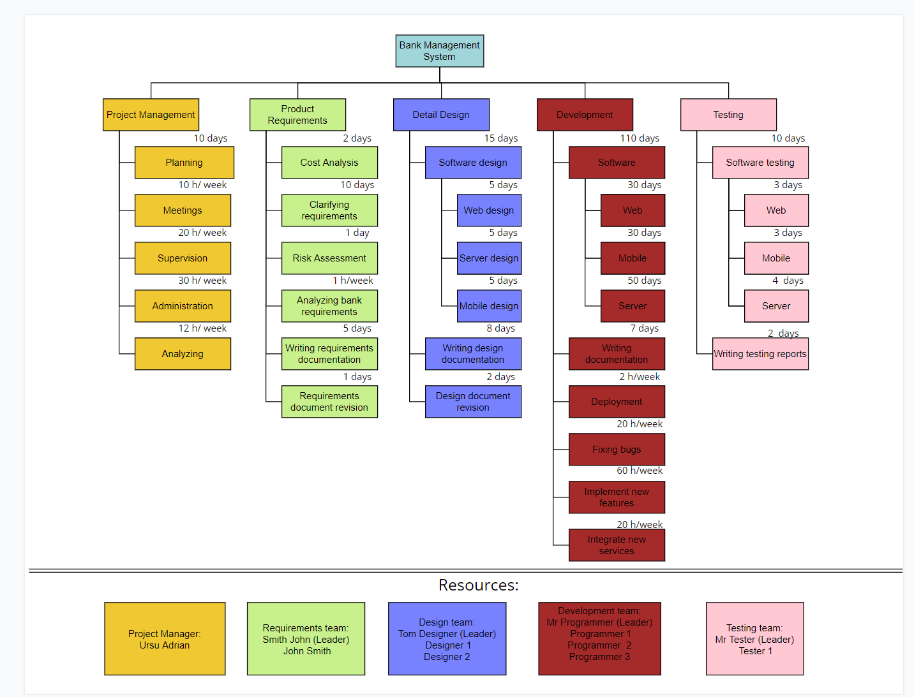

# InfrastructureRepresentation

# Ursu Adrian P-1842

## Cuprins
* [Echipa](#echipa)
* [Informatie generala](#informatie-generala)
* [Limbaje](#limbaje)
* [Resurse](#resurse)
* [Imagine arhitecturala](#imagine-arhitecturala)

## Echipa
* Ursu Adrian - Project Manager
* John Smith - Requirements Team
* Tom Designer (+2 persons) - Designer Team
* Mr Programmer (+3 persons) - Python Programmers Team
* Mr Tester (+1 person) - Testing Team

## Informatie generala
Proiectul dat este un sistem de management pentru tranzactii bancare, care eficientizeaza, reduce costuri si modernizeaza sistemul bancar.
Proiectul foloseste cele mai noi tehnologii si abilitati contemporane de programare.
Bring development to the next level.
	
## Resurse
* Umane - 10 oameni
* Financiare - $150 000
* Fizice
  * Calculatoare
  * Birou
  * Transport
  * Asigurare
  * Securitate
* Informationale
  * articole
  * cărți
  * referințe
  * motoare de căutare(Google)
 
## Limbaje de programare
Proiectul a fost creat in:
* Python: 3.10.2
* Django: 4.0.3
* DRF: 3.12
	
## imagine arhitecturala

 

© 2022 GitHub, Inc.
Terms
Privacy
Security
Status
Docs
Contact GitHub
Pricing
API
Training
Blog
About
